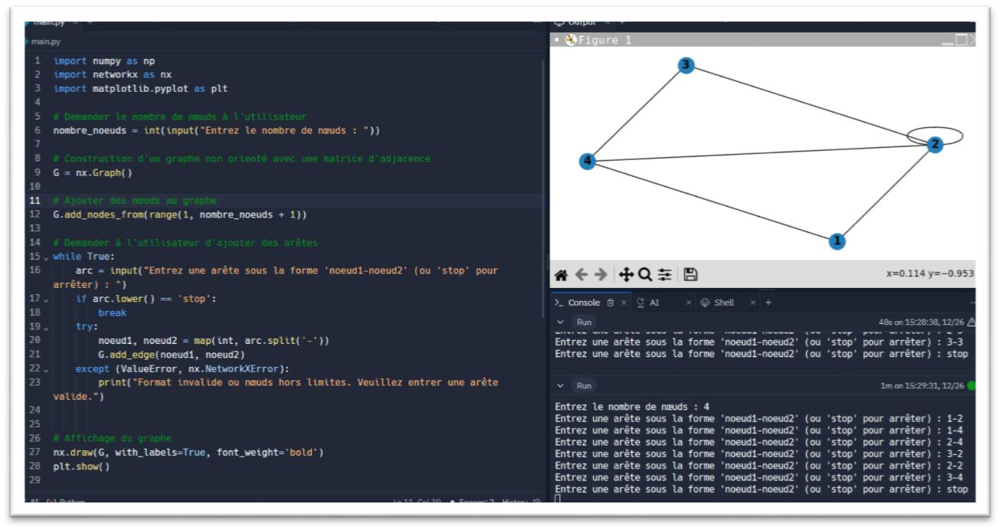
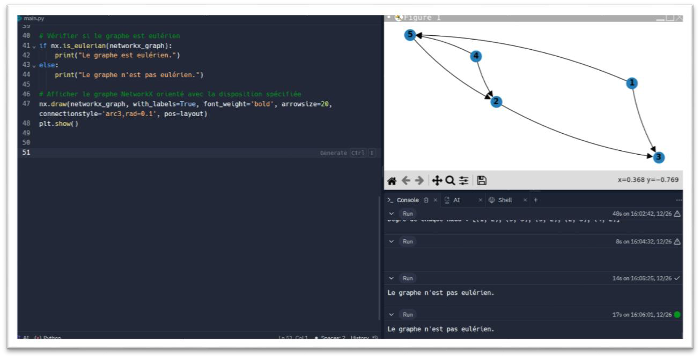

# Implémentation et Analyse de Complexité d'Algorithmes sur les Graphes

Ce projet a été réalisé dans le cadre du module "Algorithmique Avancée et Complexité" pour le Master 1 en Bio-Informatique à l'USTHB (Année 2023/2024).

Il s'agit d'une implémentation en Python d'opérations fondamentales sur les graphes, accompagnée d'une analyse de leur complexité. Le projet explore les deux représentations principales des graphes (matrice d'adjacence et liste d'adjacence) et compare leurs performances.

## 📜 Description

Le programme `graph_analyzer.py` offre une interface en ligne de commande pour :
- Construire des graphes, orientés ou non.
- Afficher graphiquement les structures créées.
- Exécuter une série d'analyses algorithmiques sur le graphe courant.

## ✨ Fonctionnalités

Le programme implémente les opérations suivantes :

- **Création et Affichage :**
  - Construction de graphes orientés et non orientés.
  - Visualisation graphique à l'aide de `matplotlib`.

- **Analyse de Propriétés :**
  - Calcul de la **densité** du graphe.
  - Calcul des **degrés** (degré simple, entrant et sortant).
  - Vérification si un graphe est **Eulérien**.
  - Vérification si un graphe est **Complet**.
  - Vérification si un graphe est un **Arbre**.

- **Algorithmes de Parcours et de Recherche :**
  - Recherche de **tous les chemins simples** entre deux nœuds.
  - Recherche du **chemin le plus court** entre deux nœuds (basé sur le nombre d'arêtes).
  - Identification de tous les **cycles** dans un graphe orienté.

## 🛠️ Prérequis

- Python 3.6 ou supérieur
- Les bibliothèques listées dans `requirements.txt`

## 🚀 Comment l'exécuter

1.  **Clonez le dépôt (ou téléchargez les fichiers) :**
    ```bash
    git clone https://github.com/aylaib/Projet-Analyse-Graphes.git
    cd Projet-Analyse-Graphes
    ```

2.  **Installez les dépendances :**
    ```bash
    pip install -r requirements.txt
    ```

3.  **Lancez le programme :**
    ```bash
    python graph_analyzer.py
    ```

4.  Suivez les instructions du menu pour interagir avec le programme.

## 📊 Documents de Référence

- [Rapport du Projet](./rapport_projet.pdf) : Contient l'analyse théorique, les tableaux de complexité et l'évaluation expérimentale.
- [Énoncé du Devoir](./enonce_devoir.pdf) : Le sujet original du projet.

## 📸 Captures d'écran

Voici quelques exemples d'utilisation du programme.

**Construction d'un graphe non orienté et ajout d'arêtes :**


**Construction d'un graphe orienté et ajout d'arcs :**

